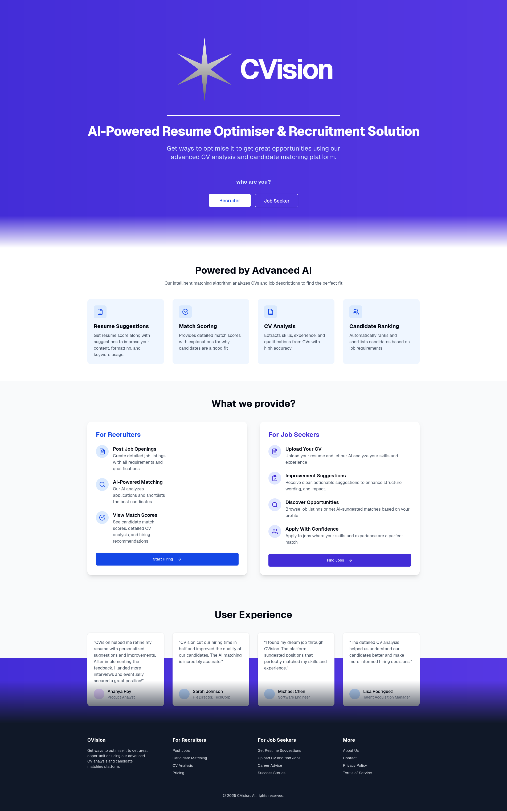
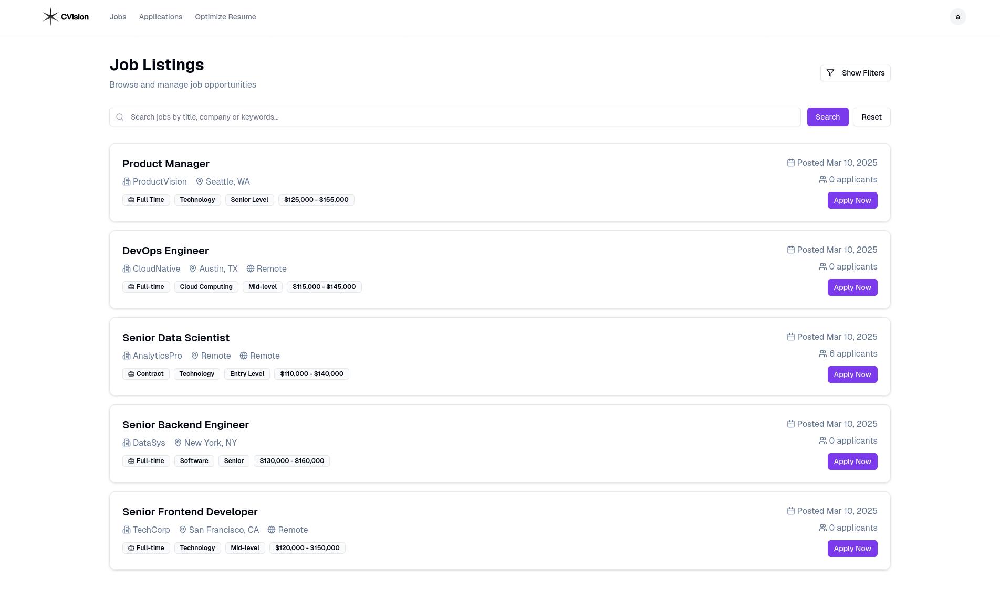
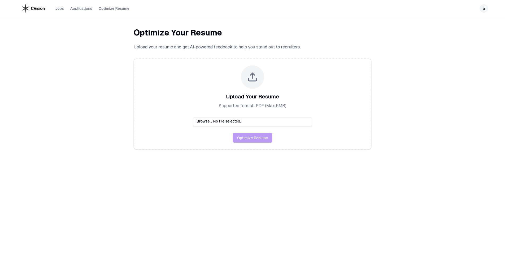

# JobWise

**JobWise** is an intelligent job matching and recruitment assistant platform designed for both **job seekers** and **recruiters**. Powered by AI, it helps users enhance their resumes, discover relevant job opportunities, and empowers recruiters to efficiently find the best talent with precision.

Whether you're a recent graduate, a mid-career professional looking for a switch, or a recruiter overwhelmed with applications—JobWise provides smart, data-driven assistance to make the process smoother, faster, and more accurate.

---

## ✨ Key Highlights

* 🔍 **AI-Powered Resume Evaluation**: Upload your resume to receive instant feedback on structure, tone, and keyword optimization.
* 🎯 **Smart Job Matching**: Get matched with jobs tailored to your skills, experience, and goals.
* 🧠 **Recruiter Dashboard**: Employers can shortlist candidates with the highest compatibility scores and view AI-extracted details at a glance.
* 📊 **Intuitive Dashboard**: Simple, modern UI for both candidates and recruiters.


## 🚀 Tech Stack

This project leverages a modern web stack, combining **React-based frontend**, **Python AI backend**, and **monorepo architecture** for scalability and developer productivity.

| Layer         | Stack                                                     |
| ------------- | --------------------------------------------------------- |
| Frontend      | Next.js(React.js) , Tailwind CSS, TypeScript                         |
| Backend       | Node.js, Python (FastAPI API)                         |
| AI/ML         | PyTorch, Modern BERT, GROQ                                |
| Database      | MongoDB, PostgreSQL |
| ORM           | Prisma                                                    |
| Monorepo Tool | Turborepo                                                 |
| Dev Tools     | ESLint, Prettier                                          |

---

## 📦 Features Overview

### 👤 For Job Seekers

* Sign up and build a profile
* Upload your resume (PDF)
* Get AI-generated suggestions to improve your resume
* View job matches ranked by fit score
* Track applied jobs and responses

### 🧑‍💼 For Recruiters

* Create job postings
* View and filter applicants with resume summaries
* Use AI-powered shortlisting to quickly identify top candidates
* Access detailed candidate insights (skills, experience, alignment with JD)

---

## 🧠 AI Components

The intelligence behind JobWise lies in its AI subsystems:

### `model/API.py`

* Built with Python and PyTorch
* Extracts structured info from resumes (skills, experiences, education)
* Compares resume against job descriptions using BERT embeddings
* Outputs relevance score and improvement feedback

### `apps/web/lib/gemini.ts`

* Interacts with AI APIs (like Google Gemini or GPT-like models)
* Provides grammar and tone suggestions
* Extracts high-level insights and recommendations from resumes

---

## 🏗️ Project Structure

```
jobwise/
├── apps/
│   ├── web/        # Next.js frontend
│   └── docs/       # Documentation site (optional)
├── packages/
│   └── database/   # Prisma ORM + env config
├── model/          # Python AI backend
├── .env.example    # Environment variable boilerplate
└── turbo.json      # Turborepo config
```

## Features

- User Authentication (Sign-up, Sign-in)
- Job Listings
- Job Application Submission (potentially with resume upload)
- User Dashboard
- AI-powered features (e.g., resume review, job matching)
- Recruiter tools:
    - Shortlist candidates with best matching profiles
    - View extracted relevant information about candidates

## How to Run

1. **Clone the repository:**

   ```bash
   git clone https://github.com/ayushk-1801/cvision
   cd cvision
   ```

2. **Install dependencies:**

   Choose your package manager and run the install command in the root directory. For example, with npm:

   ```bash
   npm install
   ```

   Or with yarn:

   ```bash
   yarn install
   ```

3. **Set up environment variables:**

   Copy the example environment files for the database and web app:

   ```bash
   cp .env.example ./packages/database/.env
   cp .env.example ./apps/web/.env
   cp .env.example ./apps/docs/.env
   ```

   Update the environment variables accordingly.

4. **Migrate your database:**

   Create and apply database migrations:

   ```bash
   # Using npm
   npm run db:migrate:dev
   ```

   (Or `yarn run db:migrate:dev`, `pnpm run db:migrate:dev`, `bun run db:migrate:dev`)

   You'll be prompted to name the migration.

5. **Build the application:**

   ```bash
   # Using npm
   npm run build
   ```

   (Or `yarn run build`, `pnpm run build`, `bun run build`)

6. **Start the development server:**

   ```bash
   # Using npm (from the root or apps/web)
   npm run dev
   ```

   ```bash
   cd model/
   python3 API.py
   ```

   The application will be available at `http://localhost:3001`.

## Demo

Live demo: [https://jobwise-hiring.vercel.app/](https://jobwise-hiring.vercel.app/)

## Screenshots




